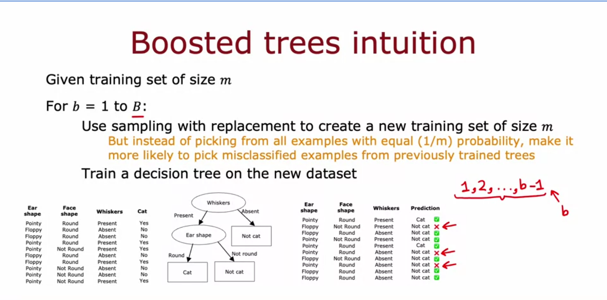
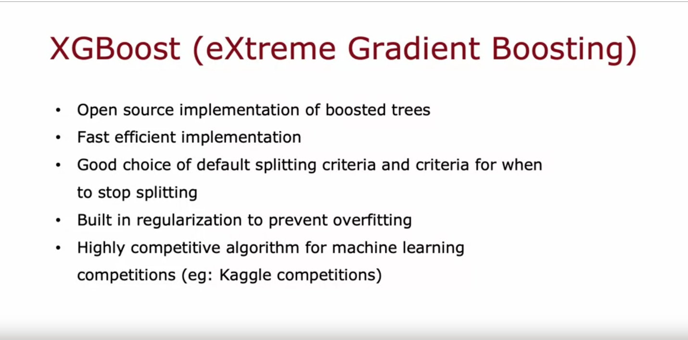
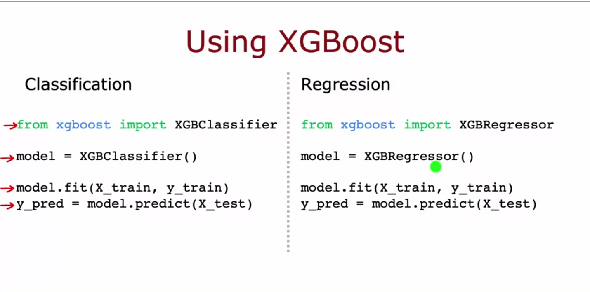

- look at the subset that are not performing well and focus on them.
	- 
	- 
	- doesnt use sampling with replacement rather assigns different weights to different samples to be more efficient.
	- 
	-