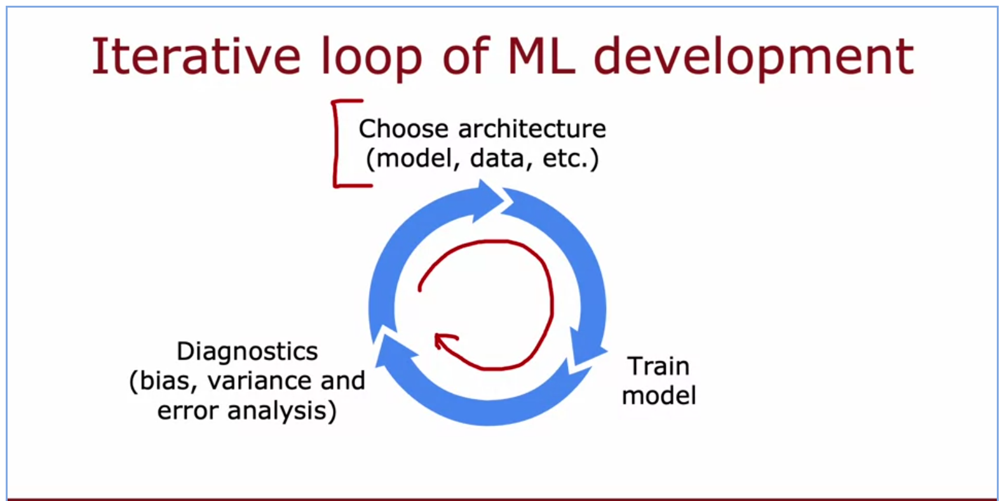
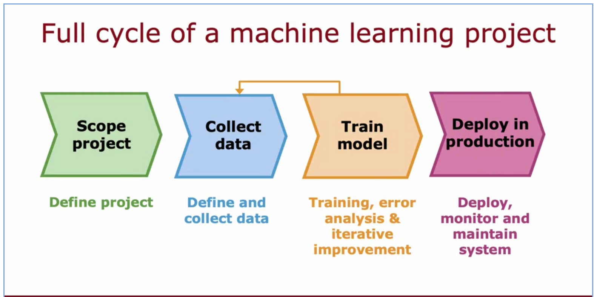
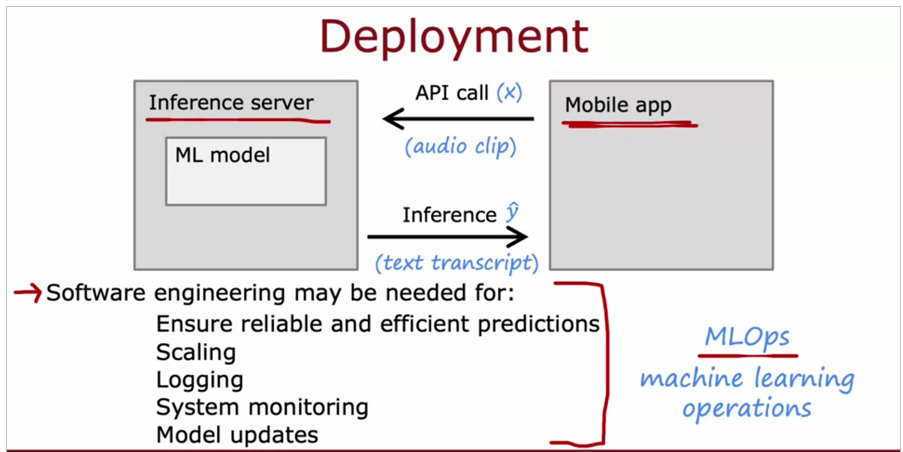
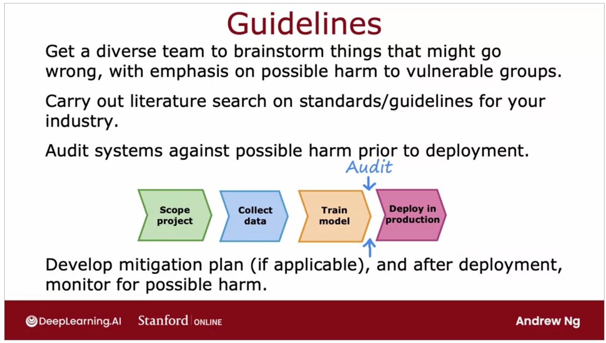
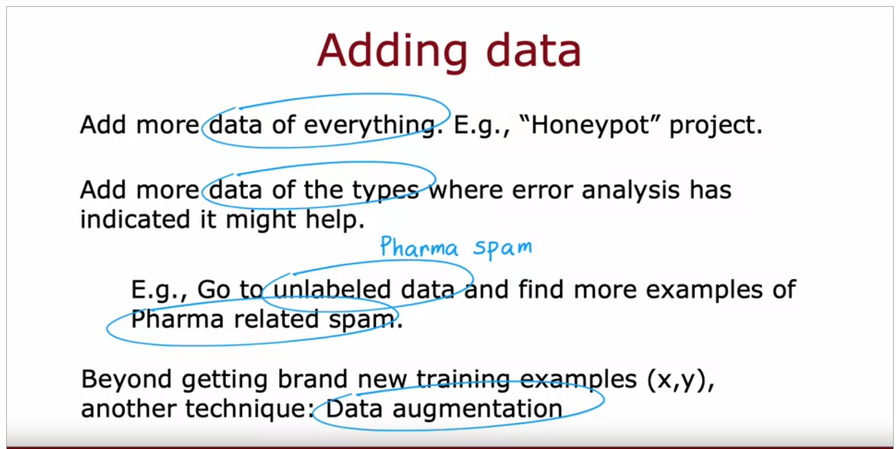
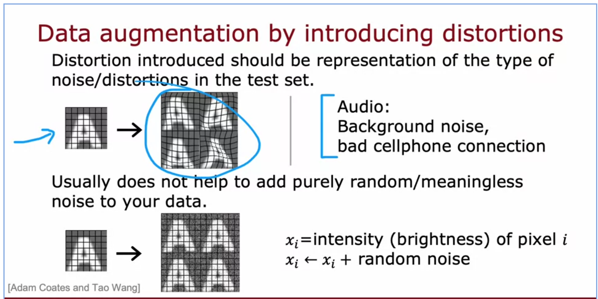
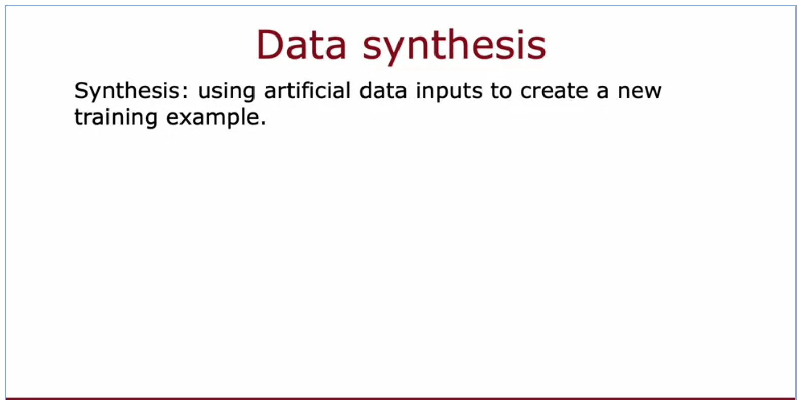
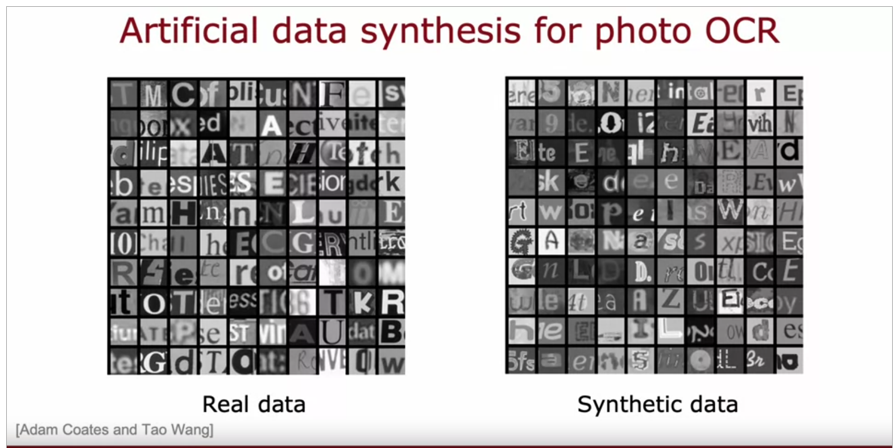

- Is a sub field of #[[Artificial Intelligence]]
- Gives the ability to predict outcomes without being explicitly programmed.
- [[machine learning]] is about creating and implementing algorithms that let machines receive data an us it for:
	- predictions
	- patterns
	- recommendations
- Types:
	- [[Machine Learning/ Supervised Learning]]
	- [[Machine Learning/ Unsupervised Learning]]
	- [[Machine Learning/ Reinforcement Learning]]
- Algorithms:
	- [[Machine Learning/ Neural Networks]]
	- [[Machine Learning/ Decision Trees]]
	- [[Machine Learning/ Regression Trees]]
	- [[Machine Learning/ Tree ensemble and Random forest]]
	- [[Machine Learning/ XGBoost]]
- Evaluation:
	- [[Machine Learning/ PCA]]
	-
- Diagnosis:
	- [[Machine Learning/ Bias and Variance]]
	- [[Machine Learning/ Debugging]]
	- [[Machine Learning/ Error Analysis]]
	-
	-
	-
- ML development Loop:
	- 
	- 
	- 
	- 
	-
- Data augementation:
	- 
	- 
	- 
	- 
	- 
- [[Machine Learning/ Error Metrics]]
- [[Machine Learning/ Regularization]]
-