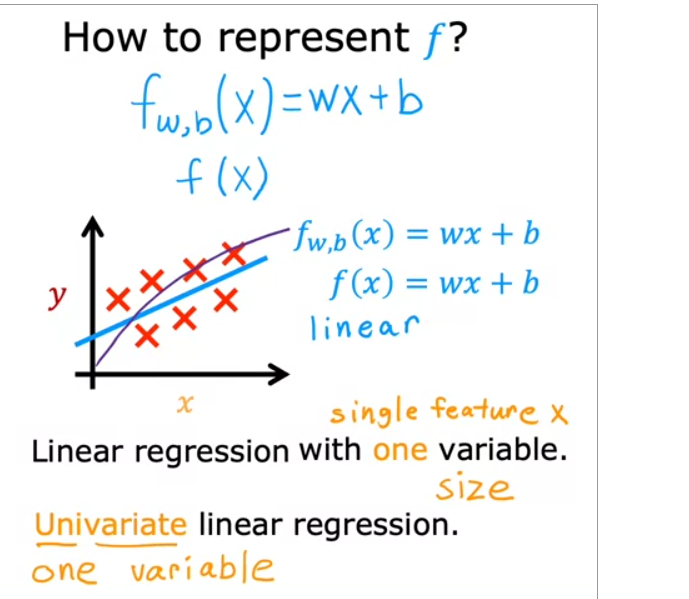
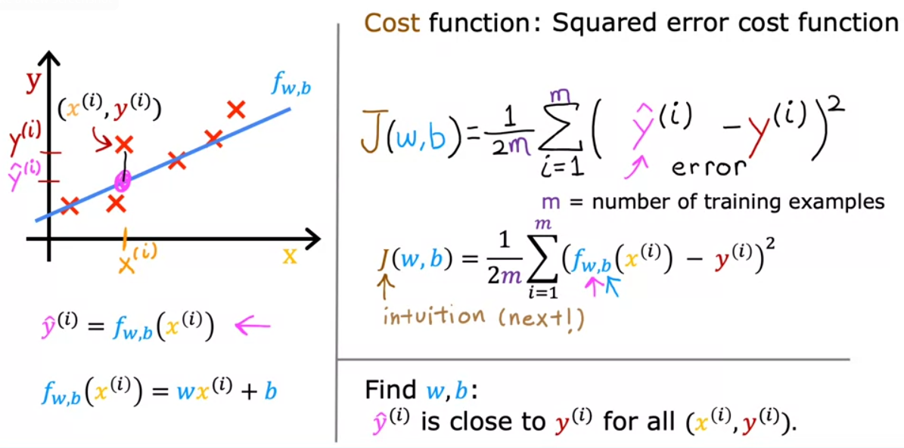
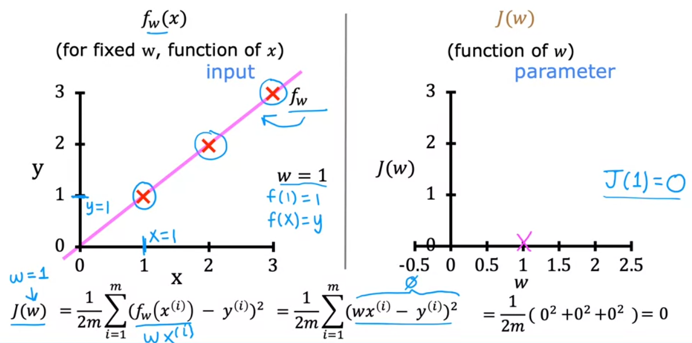
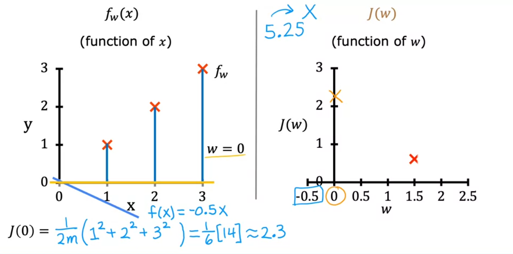
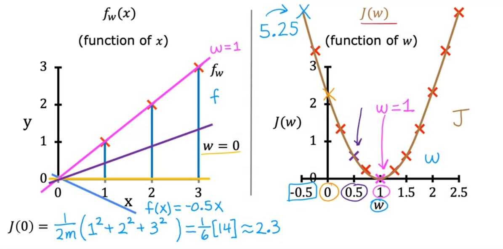

- 
- f(x) = wx+b
- w,b: parameters , coefficients or weights.
- 
- cost function?
	- measure error
	- 
	- the 2 in 2mis to make calculations cleaner.
- 
- minimize j(w)
- 
- 
- 
- 
- use contour plots
- methods of optimal parameter finding:
	- [[Machine Learning/ Supervised Learning/ Gradient decent]]
	- [[Machine Learning/ Supervised Learning/ Normal equation]]
- Practical tips
	- Feature scaling
		- Large number value in a feature will likely be tuned and work better with small parameter values and vise versa.