- collabrative filtering:
	- 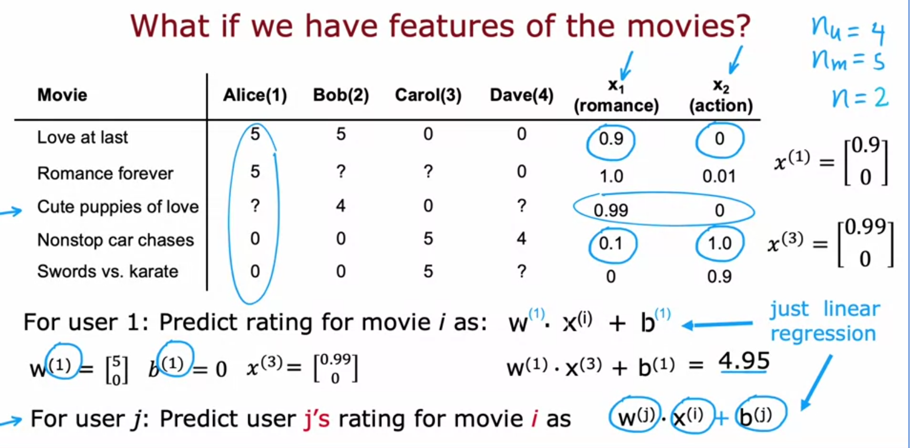
	- 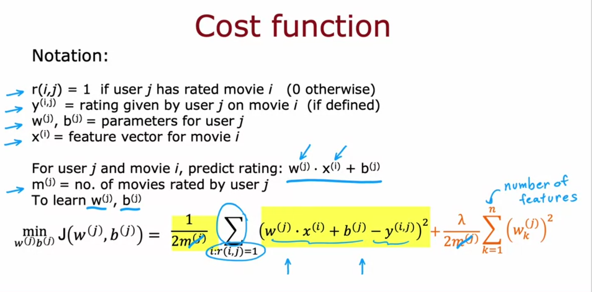
	- 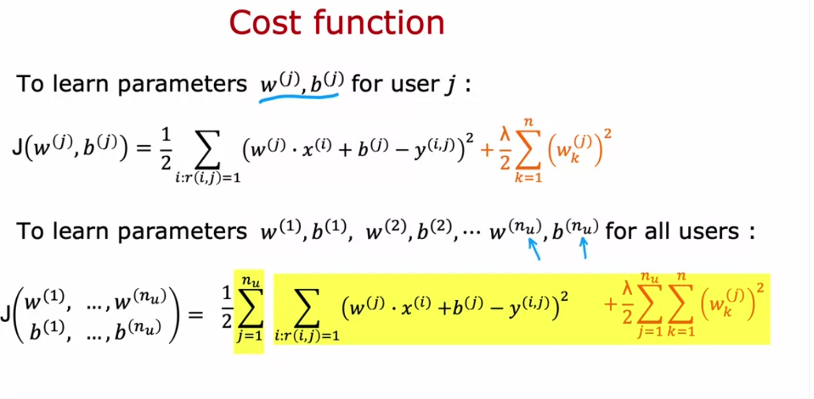
	- 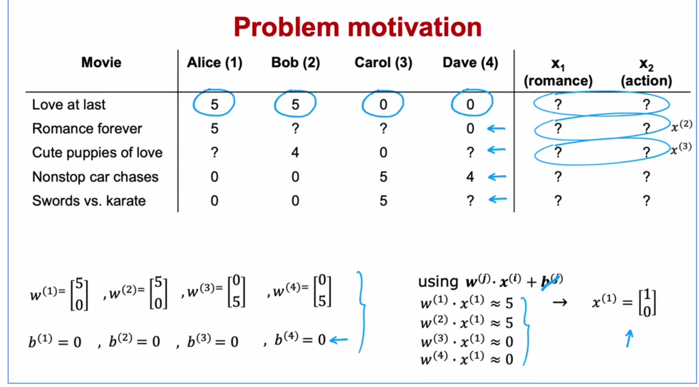
	- 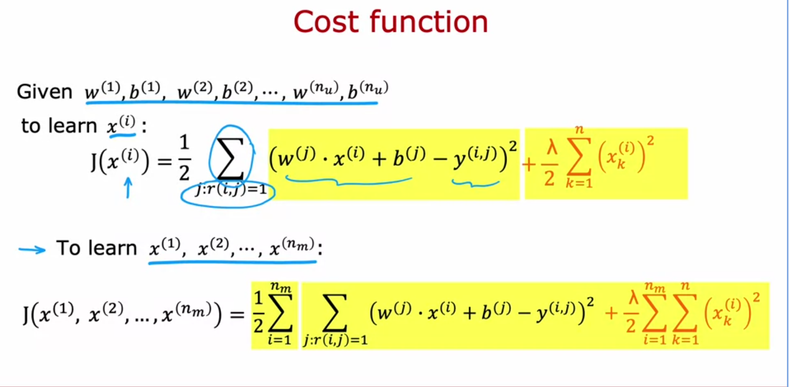
	- 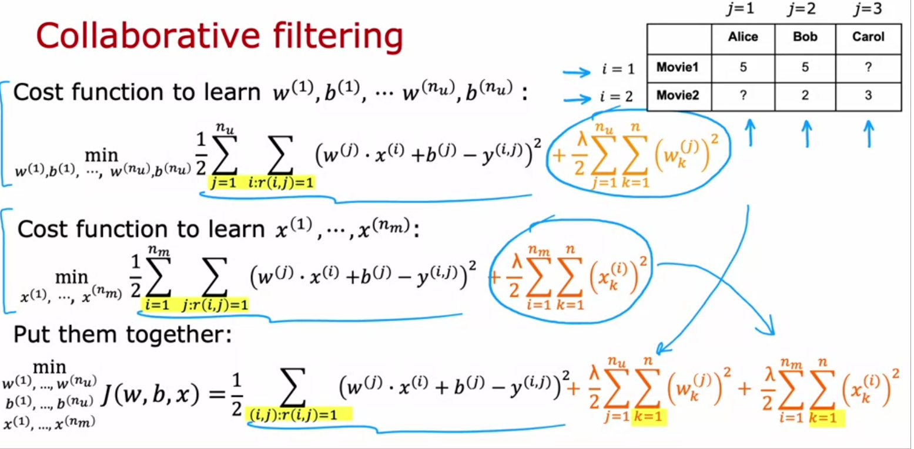
	- 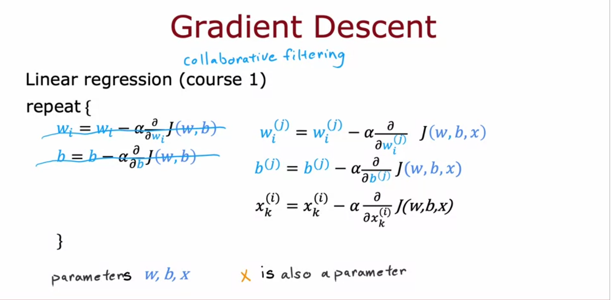
	- 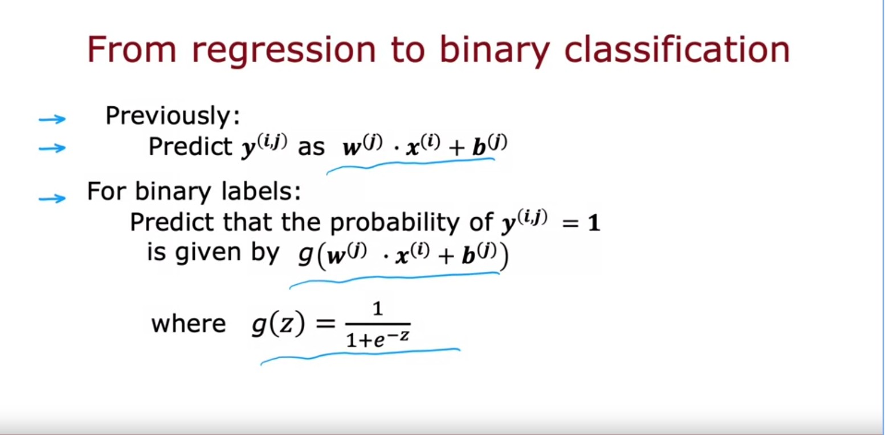
	- binary cross entropy function:
		- 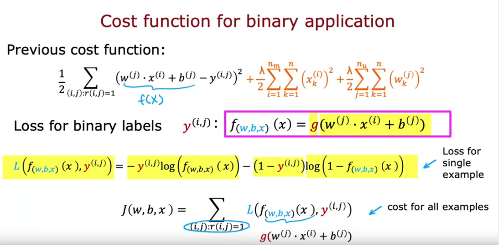
- Mean normalization:
	- 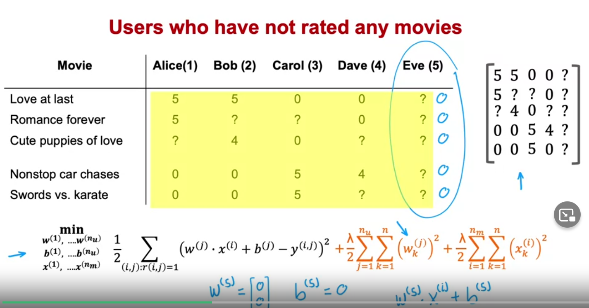
	- 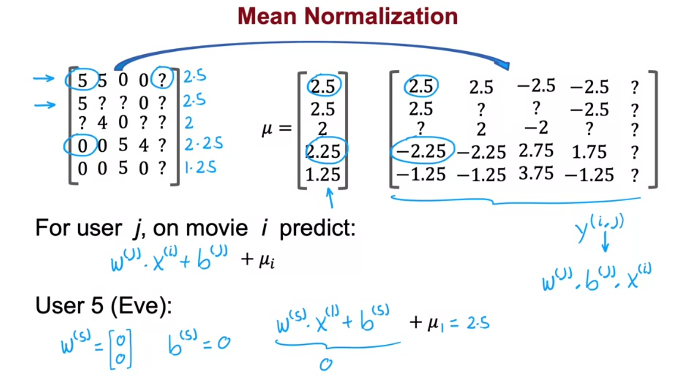
	- prediction of new users is more reasonable and algorithm is much faster.
	- column averaging is less reasonable.
- Tensorflow implementation:
	- 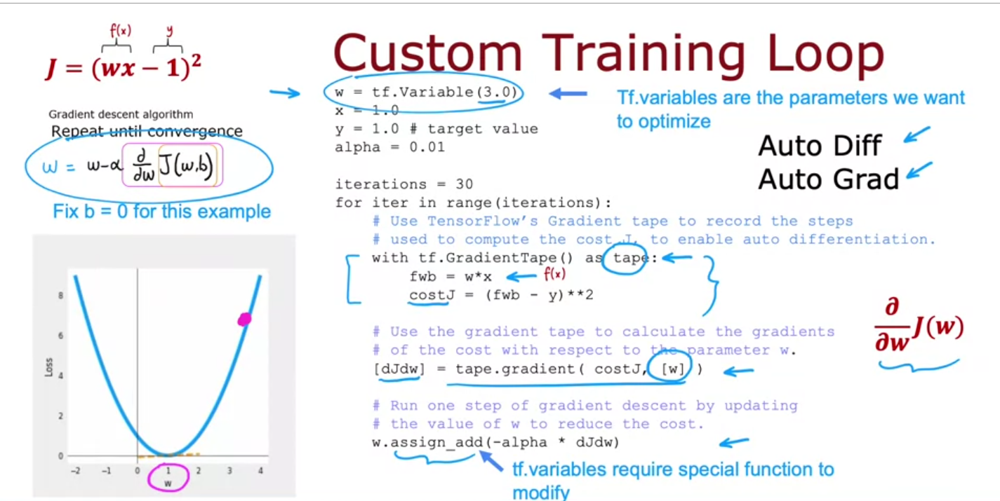
	- 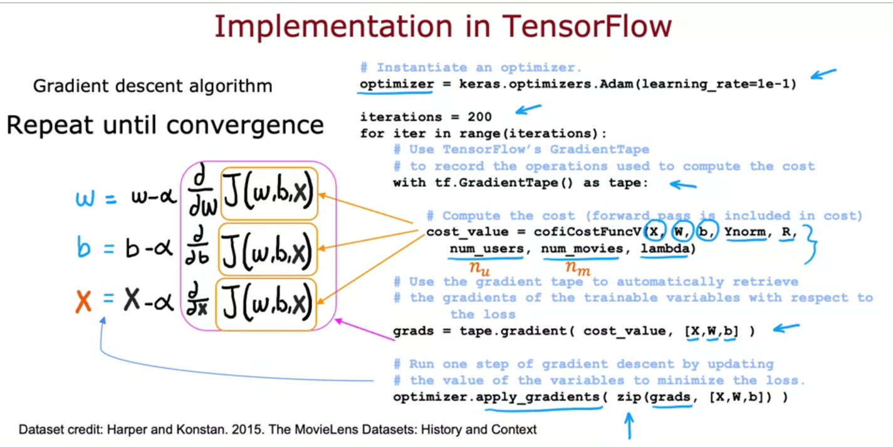
- similar items:
	- 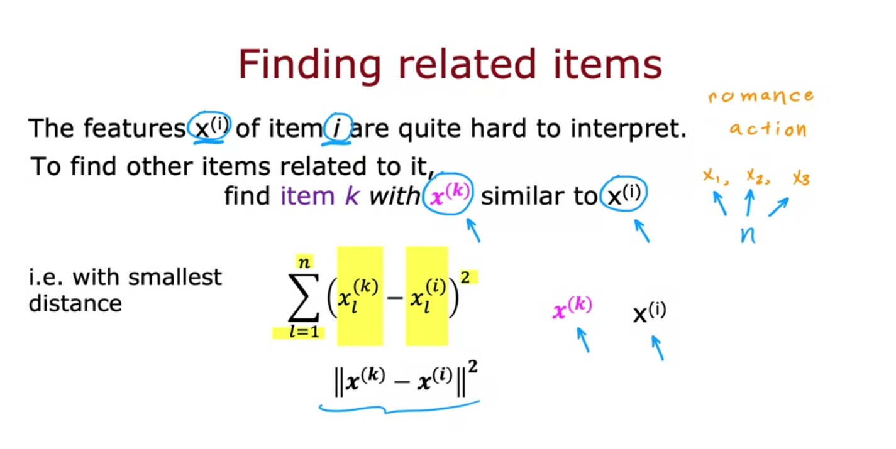
	- 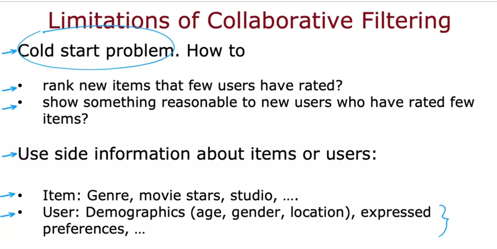
- Collaborative filter v.s content-based filtering:
	- 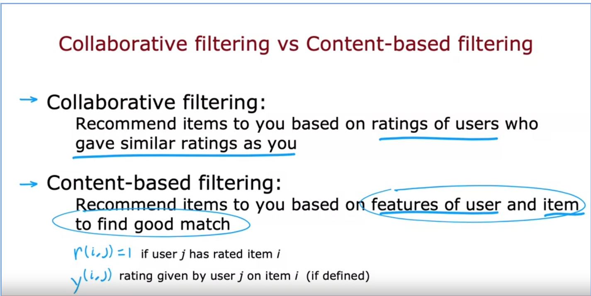
		- 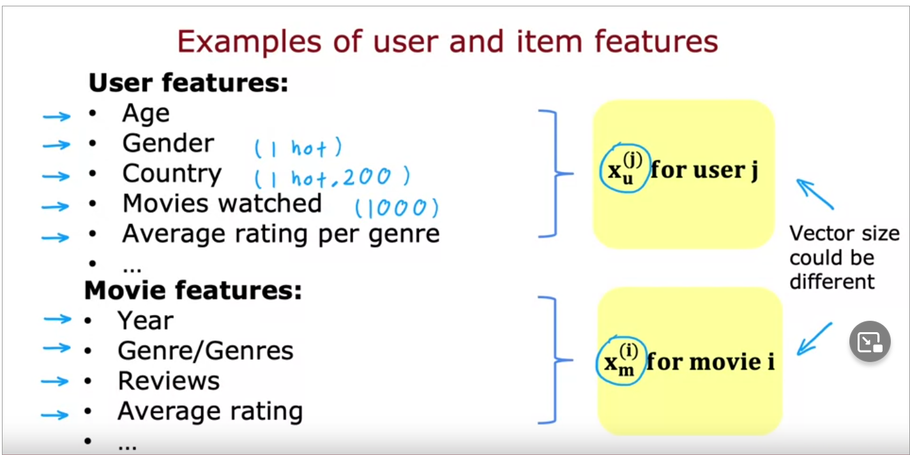
		- 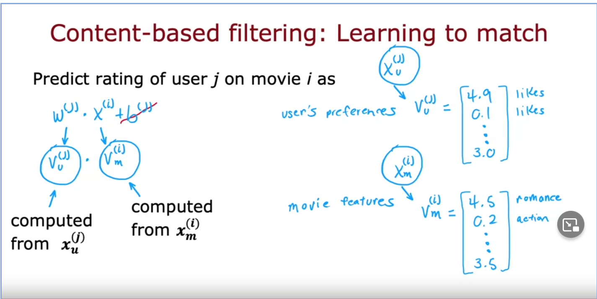
		  id:: 63f51f2f-3521-42b5-81d4-1f2727ce295a
		- feature content has to be same size , vu and vm in the above example.
- Neural network content based filtering
	- [[Machine Learning/ Neural Networks]]
	-