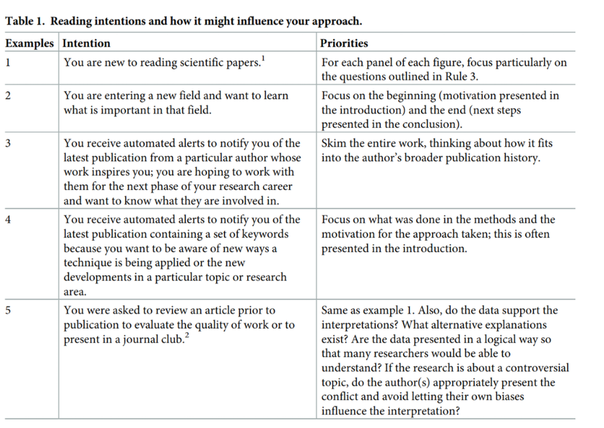

- 
	- Big picture Rules:
		- Pick your reading goal:
			- Intention behind read and extraction goal. read based on that.
		- Understand author's goal:
			- who is the author, interests and field of expertise and how the writing fits in.
			- 
		- Ask six questions:
			- What the author wants to know/ motivation?
			- What did they do/ approach?
			- Why was it done that way?
			- What does the results show?
			- How did the author interpret the results?
			- What should be done next?(also ask yourself)
		- Unpack figures and Tables:
			- Either asses data first or main text both are valid. The key is to understand data and how it is obtained.
			- Identify experimental groups and variables. Refer back to appropriate sections when further details are needed answering the six Qs.
		- Understand the formatting intentions:
			- Each section format should guide interpertation.
			- All influenced by author's interpretation.
			- check relevant website for further formatting intentions. For also goal of each section.
		-
	- Philosophy of reading Rules:
		- Be critical:
			- Reader must be able to or attempt to pushback author's ideas even if they align with your own hypothesis.
			- Find mistakes or limitations in methodology and limits to generalizability(selection bias, unaddressed or unappreciated confounders.
		- Be Kind:
			- Give benefit of the doubt.
			- Consider reference count limit.
			- Avoid evaluations based on minor errors.
			- Be kind in sharing critiques of the work.
		- Be ready  to go the extra mile:
			- Dig up terms you don't understand.
			- Read three times to digest
				- read without pressure of understanding, second aim to understand and third take notes.
	- Now what? Whats next Rules:
		- Talk about it:
			- Force active reading and participation.
			- Teach it.
		- Build on it:
			- Present it, make each into small bricks/lego that fit into a larger wall.
			- integrate knowledge from different research papers.
			- Connect it with your own work and ideas.
			- challenge and/or support the hypothesis with a more extensive review.
- Rules for structuring papers:
	- A successful paper communicates the connections between data, methods, and
	  interpretations.
	- Principles:
		- Present only one central contribution per paper, which you communicate in the title.
			- Science is, after all, the
			  abstraction of simple principles from complex data.
		- Write for flesh-and-blood human beings who do not know your work:
			- Consider the perspective of a less qualified person than you in the topic.
			- Consider human psychology and mind limitations in writing, working memory capacity and other simliar constraints/behaviors.
		-