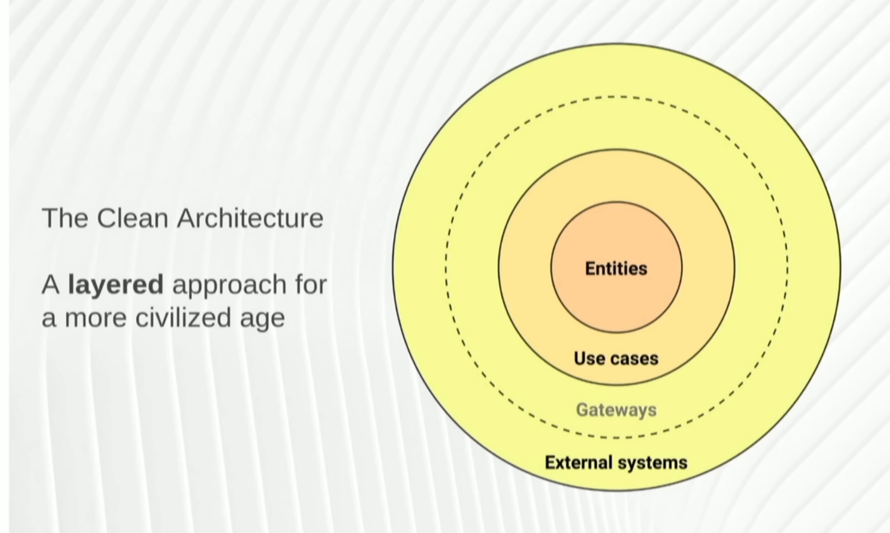
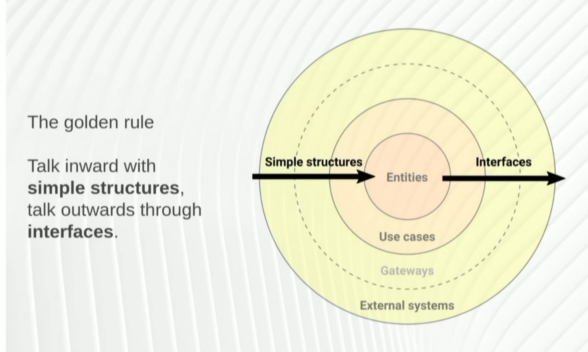
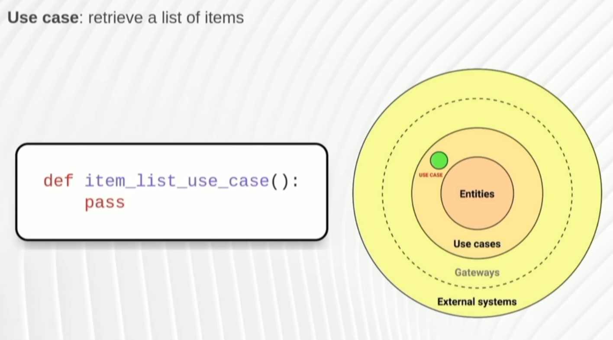
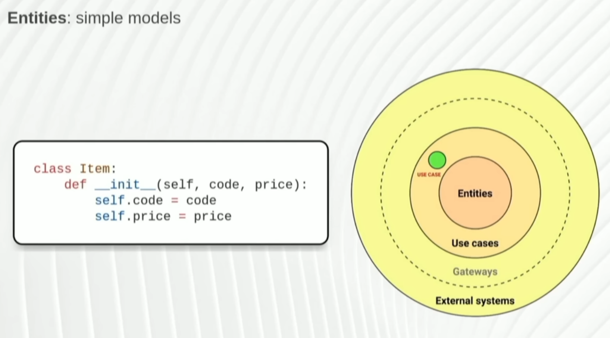
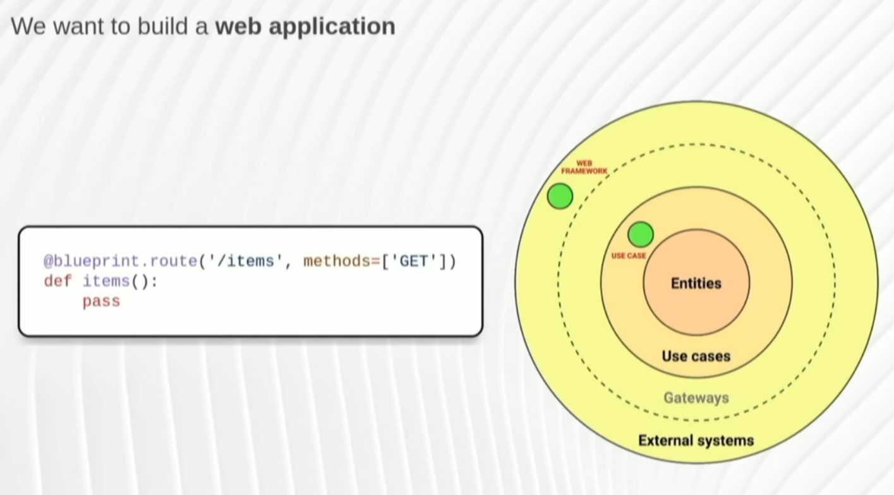
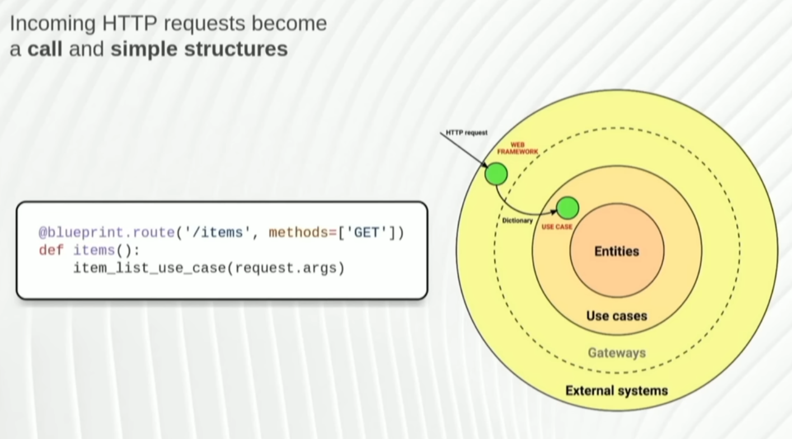
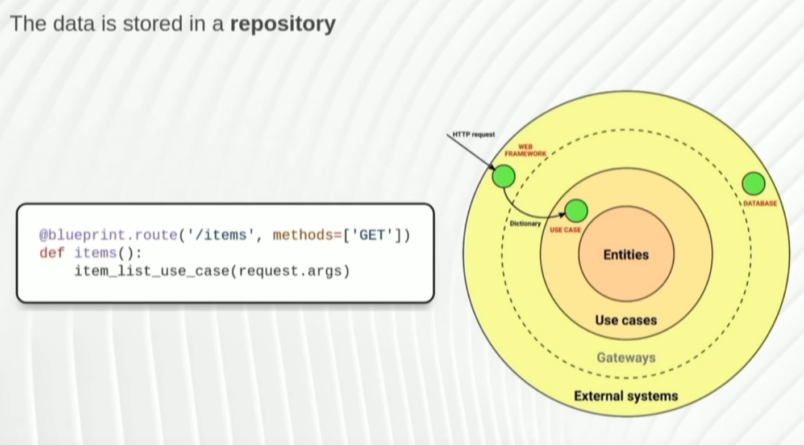
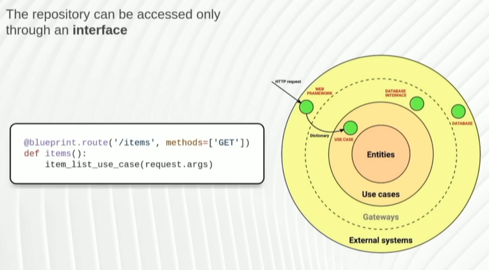
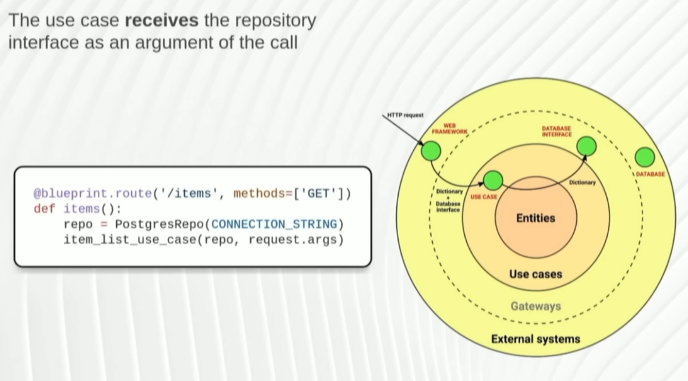
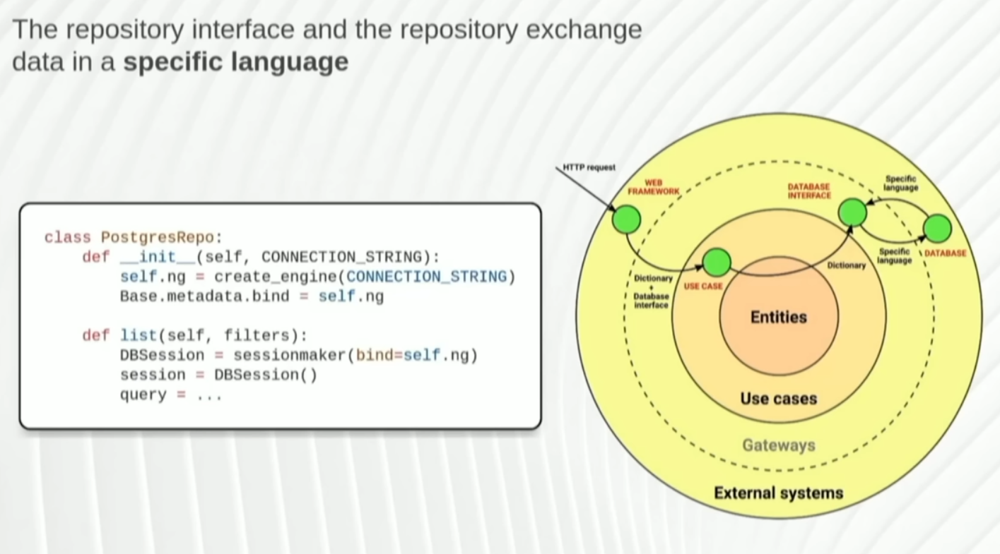

- [[Python]]
- What is architecture:
	- ability ,utility and beauty
	- durable usable
	- The art and science in which the components of a computer systems are organized and integrated.
		- the art and science of designing and making buildings
		- the internal organization of a computers components with particular reference to the way in which data is transmitted.
	- do we need it?
		- objects are a form of a distributed system.
		- easy to understand  where it is , what it is and why it is in the system.
- what is clean architecturre(robert martin)
	- 
	- layer components only see themselves and inwards.
	- 
	- what is an interface?:
		- 
		- 
		- data encapsulation
		- 
		- what is the task:
			- 
	- 
	- 
	- a detail: not part of buisness model aka  not part of feature sold or output.
	- decouple usecases from details.
	- facade a set of methods common to a detail.
	- 
	- dependency injection:
- 
- 
-