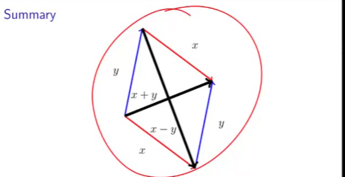

- [[Linear Algebra]]
-
- Vector is an ordered array
- each entry is a component.
- Components  are Indexed starting 0
- Belongs to real numbers
- Has direction and length starting from origin point.
- Length is euclidean
- Unit Basis Vectors(Standard basis vectors)
	- of size n of zeros except 1 component which is the indicated index one e.g: e of 3 , third is 1.
	- Generalizes notation to arbitrary length vectors.
- 2 vectors are equal only when all of their elements are equal
- Vectors dont have a spacial location. therefore heeling vectors is possible (heel to toe)
- black vector is heel to toe addition of 2 vectors. choice of which is heel and toe doesn't matter.
- scaling is same as stretching a vector.
- scaled vectors have same direction but different length.
- vector subtraction is the opposite diagonal to vector addition
- 
- AXPY(scaled vector addition) scalar Alpha time X plus Y  : ax+y
- vector memops for axpy, 1 memop for multiplier, 3 * n memops (2 read 1 write), 2*n floating ops.
- Linear combination of vectors scales the individual vectors then adds them
- Dot or inner product.
  multiply each element by it corresponding vector element and add each consecutive multiplication(summation of element multiplication)
-